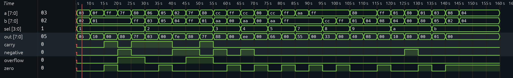

# 8-Bit ALU with Flags in Verilog

## Overview

This project implements an 8-bit Arithmetic Logic Unit (ALU) in Verilog HDL with support for arithmetic, logical, shift, and comparison operations. The design also generates four common processor status flags:

* Carry Flag (C)
* Overflow Flag (O)
* Zero Flag (Z)
* Negative Flag (N)

Functionality is verified using a custom Verilog testbench and waveform simulation.

## Features

### Supported Operations

| Opcode | Operation           |
| ------ | ------------------- |
| `0001` | Addition (A + B)    |
| `0010` | Subtraction (A - B) |
| `0011` | Bitwise AND         |
| `0100` | Bitwise OR          |
| `0101` | Bitwise XOR         |
| `0111` | Bitwise NOT A       |
| `1000` | Bitwise NOT B       |
| `1001` | Logical Shift Right |
| `1010` | Logical Shift Left  |
| `1011` | Compare (A < B)     |

### Status Flags

| Flag         | Description                                                             |
| ------------ | ----------------------------------------------------------------------- |
| Carry (C)    | Set when addition produces a carry-out or subtraction requires a borrow |
| Overflow (O) | Set when signed arithmetic overflow occurs                              |
| Zero (Z)     | Set when the output equals zero                                         |
| Negative (N) | Set when the most significant bit of the output is 1                    |

## Project Structure

```text
.
├── src/
│   └── ALU_flags.v
├── tb/
│   └── ALU_flags_tb.v
├── docs/
│   └── waveform.png
└── README.md
```

## Tools Used

* Visual Studio Code

### Extensions

* Verilog-HDL/SystemVerilog
* Surfer

## Test Coverage

The testbench verifies:

### Addition

* Normal addition
* Carry generation
* Signed overflow
* Zero result detection

### Subtraction

* Normal subtraction
* Borrow detection
* Signed overflow
* Negative result detection

### Logical Operations

* AND
* OR
* XOR
* NOT A
* NOT B

### Shift Operations

* Logical Shift Left
* Logical Shift Right
* Large shift amounts

### Comparison

* A < B
* A > B
* A = B

## Simulation Results

Waveform verification:



The generated waveform confirms correct operation of the ALU and all status flags across the tested scenarios.

## How to Run

1. Open the project in Visual Studio Code.
2. Install the following extensions:

   * Verilog-HDL/SystemVerilog
   * Surfer
3. Open `src/ALU_flags.v` and `tb/ALU_flags_tb.v`.
4. Run the testbench using your Verilog simulator.
5. The simulation will generate the waveform file:

```text
flag_result.vcd
```

6. Open the generated VCD file using the Surfer extension to inspect signal transitions and verify ALU functionality.

## Example Operations

### Addition with Overflow

```text
A = 127
B = 1

Output   = 128
Carry    = 0
Overflow = 1
Zero     = 0
Negative = 1
```

### Subtraction with Borrow

```text
A = 2
B = 4

Output   = 254
Carry    = 1
Overflow = 0
Zero     = 0
Negative = 1
```

## Author

Nishaanth Sai Vinodh Kumar
